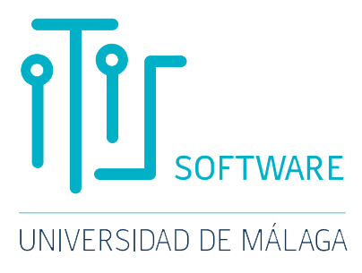
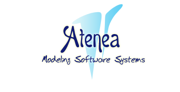

# avallecillo.github.io
Personal web page of Antonio Vallecillo
<!DOCTYPE html>
<html lang="en">
<head>
  <meta charset="UTF-8">
  <meta name="viewport" content="width=device-width, initial-scale=1.0">
  <title>Antonio Vallecillo — Home Page</title>
  <link rel="preconnect" href="https://fonts.googleapis.com">
  <link rel="preconnect" href="https://fonts.gstatic.com" crossorigin>
  <link href="https://fonts.googleapis.com/css2?family=Playfair+Display:wght@400;600&family=Source+Serif+4:ital,wght@0,300;0,400;1,300&display=swap" rel="stylesheet">
  
</head>
<body>

<!-- ══════════════ HEADER ══════════════ -->
<header>
  

    
  

  

    <h1>Antonio Vallecillo</h1>
    

      <a href="http://www.uma.es" target="_blank">Universidad de Málaga</a> 
      <a href="http://www.lcc.uma.es" target="_blank">Dept. Lenguajes y Ciencias de la Computación</a> 
      <a href="http://www.informatica.uma.es/" target="_blank">ETSI Informática</a>, Campus de Teatinos. 
      Bulevar Louis Pasteur, 35 · 29071 <a href="http://en.wikipedia.org/wiki/M%C3%A1laga" target="_blank">Málaga</a>, Spain
      &nbsp;<a href="http://maps.google.es/maps/ms?ie=UTF8&hl=es&msa=0&ll=36.717318,-4.477937&spn=0.017923,0.037251&t=h&z=15&msid=111919763757071472280.000451625a7012a74efb1" target="_blank">[map]</a>
    

    

      <a href="mailto:av@uma.es">
        <!-- email icon -->
        <svg class="icon" viewBox="0 0 24 24" fill="none" stroke="currentColor" stroke-width="1.6"><rect x="2" y="4" width="20" height="16" rx="2"/><path d="M2 7l10 7 10-7"/></svg>
        av@uma.es
      </a>
      <a href="http://twitter.com/AVallecillo" target="_blank">
        <svg class="icon" viewBox="0 0 24 24" fill="currentColor"><path d="M18.244 2.25h3.308l-7.227 8.26 8.502 11.24H16.17l-5.214-6.817L4.99 21.75H1.68l7.73-8.835L1.254 2.25H8.08l4.713 6.231zm-1.161 17.52h1.833L7.084 4.126H5.117z"/></svg>
        @AVallecillo
      </a>
      <a href="https://www.linkedin.com/in/avallecillo" target="_blank">
        <svg class="icon" viewBox="0 0 24 24" fill="currentColor"><path d="M20.447 20.452h-3.554v-5.569c0-1.328-.027-3.037-1.852-3.037-1.853 0-2.136 1.445-2.136 2.939v5.667H9.351V9h3.414v1.561h.046c.477-.9 1.637-1.85 3.37-1.85 3.601 0 4.267 2.37 4.267 5.455v6.286zM5.337 7.433a2.062 2.062 0 01-2.063-2.065 2.064 2.064 0 112.063 2.065zm1.782 13.019H3.555V9h3.564v11.452zM22.225 0H1.771C.792 0 0 .774 0 1.729v20.542C0 23.227.792 24 1.771 24h20.451C23.2 24 24 23.227 24 22.271V1.729C24 .774 23.2 0 22.222 0h.003z"/></svg>
        LinkedIn · AVallecillo
      </a>
      <a href="http://orcid.org/0000-0002-8139-9986" target="_blank">
        <svg class="icon" viewBox="0 0 24 24" fill="currentColor"><path d="M12 0C5.372 0 0 5.372 0 12s5.372 12 12 12 12-5.372 12-12S18.628 0 12 0zm-1.374 4.494h2.748v1.375h-2.748V4.494zm0 3.75h2.748v11.512h-2.748V8.244zm5.25 0h2.75v1.67h.036c.382-.724 1.318-1.67 2.714-1.67.094 0 .188.002.28.008v2.76a5.69 5.69 0 00-.416-.016c-1.554 0-2.364.834-2.364 2.836v5.924h-2.75V8.244z" opacity=".01"/><circle cx="12" cy="12" r="11" fill="none" stroke="currentColor" stroke-width="1.5"/><text x="12" y="16" text-anchor="middle" font-size="8" font-weight="bold" fill="currentColor">iD</text></svg>
        ORCID: 0000-0002-8139-9986
      </a>
      <a href="https://whereby.com/avallecillo" target="_blank">
        <svg class="icon" viewBox="0 0 24 24" fill="none" stroke="currentColor" stroke-width="1.6"><path d="M15 10l4.553-2.07A1 1 0 0121 8.82v6.36a1 1 0 01-1.447.89L15 14M3 8a2 2 0 012-2h10a2 2 0 012 2v8a2 2 0 01-2 2H5a2 2 0 01-2-2V8z"/></svg>
        whereby.com/avallecillo
      </a>
    

  

  

    
    
    
    
    
    
  

</header>

<!-- ══════════════ MAIN ══════════════ -->
<main>

  <!-- SHORT BIO -->
  <section>
    <h2>Short Bio</h2>
    

      Antonio Vallecillo is a retired Full Professor of Software Engineering at the University of Málaga.
      His research interests include model-based software engineering (MBSE), open distributed processing
      (<a href="http://www.rm-odp.net" target="_blank">ODP</a>), software quality, and uncertainty quantification.
      From 1986 to 1995 he worked in the computer industry at Fujitsu and ICL. In 1996 he joined
      the University of Málaga, where he has since conducted research on software modeling and analysis.
    

    

      He has been involved in standardization activities within AENOR, ISO, ITU-T and the OMG, and served as
      the Spanish representative at <a href="http://www.jtc1-sc7.org/" target="_blank">IFIP TC2</a> and
      <a href="http://www.jtc1-sc7.org/" target="_blank">ISO SC7</a>, co-editing ISO/IEC 19793 (UML4ODP)
      and the revised version of RM-ODP (ISO/IEC 10746-2/3). He led the AEN/CTN 71 Working Group on
      Techniques for the Specification of IT Systems (GT19) at UNE, and was a certified Technical Expert at
      <a href="https://www.enac.es/" target="_blank">ENAC</a> (Entidad de Acreditación Nacional).
    

    

      He has organized several international conferences, including ECOOP 2002, TOOLS 2010, MODELS 2013,
      ECOOP 2017 and <a href="https://2020.congresocedi.es/" target="_blank">CEDI 20/21</a>, and has served as
      PC Chair for ICSOC, TOOLS, ICMT, ECMFA, QoSA and QUATIC. He has been a member of the editorial boards of
      <a href="http://www.sosym.org" target="_blank">SoSyM</a>,
      <a href="https://www.springer.com/journal/12599" target="_blank">BISE</a> and
      <a href="http://www.jot.fm" target="_blank">JOT</a>. He served as Vice-President for Postgraduate and
      Doctoral Studies at the University of Málaga (2012–2016), and as President of the Spanish Society on
      Software Engineering (<a href="http://www.sistedes.es" target="_blank">SISTEDES</a>) (2014–2018).
      From 2017 to March 2020 he coordinated the <em>Computer Science and Information Technologies</em> (INF)
      subarea of the Spanish Research Agency
      (<a href="http://www.idi.mineco.gob.es/portal/site/MICINN/menuitem.8d78849a34f1cd28d0c9d910026041a0/?vgnextoid=664cfb7e04195510VgnVCM1000001d04140aRCRD" target="_blank">AEI</a>),
      and has been an assessor for the Australian Research Council
      (<a href="http://www.arc.gov.au/" target="_blank">ARC</a>) since 2013. From 2020 to 2023 he was
      Vice-President of the Spanish Society on Informatics (<a href="http://www.scie.es" target="_blank">SCIE</a>).
      He is a Senior Member of <a href="https://www.acm.org/" target="_blank">ACM</a>, an
      <a href="https://www.aaia-ai.org/" target="_blank">AAIA</a> Fellow, and a member of the
      <a href="https://www.ae-info.org/ae/Member/Vallecillo_Antonio" target="_blank">Academia Europæa</a>.
    

    

      🏆 Recipient of the <strong>2024 National Informatics Award "José García Santesmases"</strong>,
      granted by <a href="http://www.scie.es" target="_blank">SCIE</a> and the
      <a href="https://www.fbbva.es/noticias/premios-informatica-scie-fundacion-bbva-2024/" target="_blank">BBVA Foundation</a>,
      for his professional career.
    

    

      He had the honor of having the <a href="http://www.jot.fm" target="_blank">JOT</a> journal dedicate a
      <a href="https://www.jot.fm/contents/issue_2022_04.html" target="_blank">special issue on the occasion of
      his 60th birthday</a>, and the <a href="http://www.sosym.org" target="_blank">SoSyM</a> journal publish a
      special issue on
      <a href="https://link.springer.com/journal/10270/volumes-and-issues/24-3" target="_blank">uncertainty,
      modeling, CPSs and AI</a> in his honor.
    

  </section>

  <!-- PUBLICATIONS -->
  <section>
    <h2>Publications</h2>
    <ul>
      <li>For a complete list of publications, see his entries at:
        <a href="https://www.scopus.com/authid/detail.uri?authorId=57212671717" target="_blank">Scopus</a>,
        <a href="http://www.informatik.uni-trier.de/%7Eley/db/indices/a-tree/v/Vallecillo:Antonio.html" target="_blank">DBLP</a>,
        <a href="http://scholar.google.com/citations?user=yiijLskAAAAJ" target="_blank">Google Scholar</a>,
        <a href="https://www.semanticscholar.org/author/Antonio-Vallecillo/46434062" target="_blank">Semantic Scholar</a>,
        <a href="https://www.webofscience.com/wos/author/record/407403,44643621" target="_blank">WOS</a>,
        <a href="http://academic.research.microsoft.com/Author/449499/antonio-vallecillo" target="_blank">Microsoft Academic Search</a>,
        <a href="http://portal.acm.org/results.cfm?coll=portal&dl=ACM&query=Antonio+Vallecillo&short=1" target="_blank">ACM DL</a>,
        <a href="https://www.lens.org/lens/orcid/0000-0002-8139-9986/scholar" target="_blank">Lens</a>, or
        <a href="http://arnetminer.org/person/antonio-vallecillo-393999.html#.T6GbGKt-dbE" target="_blank">ArnetMiner</a>.
      </li>
      <li>Books:
        <ul>
          <li>"<a href="http://theodpbook.lcc.uma.es/" target="_blank">Building Enterprise Systems with ODP: An Introduction to Open Distributed Processing</a>", Chapman &amp; Hall/CRC Press, 2012.</li>
          <li>"<a href="http://www.ra-ma.es/libros/DESARROLLO-DE-SOFTWARE-DIRIGIDO-POR-MODELOS-CONCE%0APTOS-METODOS-Y-HERRAMIENTAS/82019/978-84-9964-215-4" target="_blank">Desarrollo de Software Dirigido por Modelos: Conceptos, Métodos y Herramientas</a>", RA-MA, 2013 (<a href="http://www.lcc.uma.es/~av/Publicaciones/12/LibroDSDM.pdf" target="_blank">PDF</a>).</li>
          <li>"<a href="http://www.lcc.uma.es/~av/Libro/" target="_blank">Técnicas de Diseño de Algoritmos</a>", SPICUM, 2000.</li>
        </ul>
      </li>
    </ul>
  </section>

  <!-- RESEARCH PROJECTS, TOOLS AND TALKS -->
  <section>
    <h2>Research Projects, Tools &amp; Talks</h2>
    <ul>
      <li><strong>Recent Research Projects</strong>
        <ul>
          <li><a href="http://atenea.lcc.uma.es/projects/IPSCA" target="_blank">Including people in smart city applications</a>. PID2021-125527NB-I00. 1/9/2022 – 31/8/2026.</li>
          <li><a href="http://atenea.lcc.uma.es/projects/SoCUS" target="_blank">Social Computing for Urban Sustainability</a>. TED2021-130523B-I00. 1/12/2022 – 1/12/2024.</li>
          <li><a href="http://atenea.lcc.uma.es/projects/COSCA" target="_blank">Digital Avatars: A Framework for Collaborative Social Computing Applications</a>. PGC2018-094905-B-I00. 1/1/2019 – 30/9/2022.</li>
          <li><a href="http://atenea.lcc.uma.es/projects/MBT-I4A" target="_blank">Automated Model-Based Testing of Industry 4.0 Applications</a>. P20-00067-FR. 5/10/2021 – 31/3/2023.</li>
          <li>(For a complete list of research projects, see his <a href="personal/CV-AVallecillo.pdf" target="_blank">CV</a>.)</li>
        </ul>
      </li>
      <li><strong>Tools:</strong> For information about tools and resources produced by the research group, visit the <a href="http://atenea.lcc.uma.es" target="_blank">Atenea</a> website.</li>
      <li><strong>Talks:</strong> Slides of recent talks are available at <a href="https://www.slideshare.net/avallecillo" target="_blank">Slideshare</a>.</li>
    </ul>
  </section>

  <!-- FURTHER INFO -->
  <section>
    <h2>Further Info</h2>
    

      
ORCID: <a href="http://orcid.org/0000-0002-8139-9986" target="_blank">0000-0002-8139-9986</a>

      
Scopus ID: <a href="https://www.scopus.com/authid/detail.uri?authorId=57212671717" target="_blank">57212671717</a>

      
ResearcherID: <a href="http://www.researcherid.com/rid/B-1884-2014" target="_blank">B-1884-2014</a>

      
Iralis: <a href="http://www.iralis.org/?q=node%2F10&paso=10&id=4953" target="_blank">ESINF4953</a>

      
Lens: <a href="https://www.lens.org/lens/orcid/0000-0002-8139-9986/scholar" target="_blank">0000-0002-8139-9986</a>

    

    <ul style="margin-top: 1rem;">
      <li>CV (<a href="personal/CVA-AVallecillo-EN.pdf" target="_blank">Short version, in English</a>)</li>
      <li>CV (<a href="personal/CV-AVallecillo.pdf" target="_blank">Full version, in Spanish</a>)</li>
    </ul>
  </section>

  <!-- ABOUT MÁLAGA -->
  <section>
    <h2>About the City and the University of Málaga</h2>
    <ul>
      <li>
        <a href="http://www.infouma.uma.es/noticias/index.php?option=com_content&task=view&id=197&Itemid=50" target="_blank">Discover the University of Málaga</a> (video) ·
        <a href="https://www.youtube.com/watch?v=9Na4yYZH2Hg" target="_blank">Have a look at Málaga</a> (video) ·
        <a href="https://www.youtube.com/watch?v=z_IyaKCij1c" target="_blank">We are from Málaga</a> (video) ·
        <a href="https://youtu.be/Wn20LXi1rsw" target="_blank">Málaga time lapse</a> (video) ·
        <a href="download/Malaga-Navidad2021.mp4" target="_blank">Xmas in Málaga</a> (video)
      </li>
    </ul>
  </section>

</main>

<footer>
  
Antonio Vallecillo · Universidad de Málaga · <a href="mailto:av@uma.es">av@uma.es</a>

</footer>

</body>
</html>

